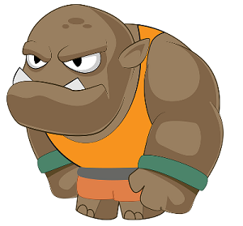

# image-effects
'image-effects' Wordpress Plugin allows you to do image processing with many awesome image effects by using shortcodes!


# Environment:
1. PHP 5.2 above with ImageMagick Extension installed
2. Wordpress 3.4 above

#	Installation
This section describes how to install the plugin and get it working.

1. In your WordPress Administration Panels, click on WP Dashboard -> Plugins -> Add New plugin
2. Click 'upload plugin' button
3. Browse and select 'image-effects.zip' and click 'install'
4. To turn the 'Image Effects Plugin' on, click Activate.

Alternatively you can also follow the following steps to install the Image Effects plugin

1. Upload the image-effects folder to the to the /wp-content/plugins/ directory
2. Activate the plugin through the ‘Plugins’ menu in WordPress

# Simple User Guide / Example

1. Text on Image (style : text_on_image):

```
[image_effects style="text_on_image" text="Hello" font-size="20" font-offset-x="20" font-offset-y="30" pic1="http://kevix.rf.gd/material/i1.jpg"]
```

**Attribute:**

| Attribute Name  | Description  | Is Required | Default Value |
| ------------ | --------------- | :-----: | -------------- |
| pic1      | The URL of Image | Y | --- |
| text      | Text On the Image | Y | --- |
| font-size      | Font Size | N | 36 |
| font-offset-x | Left margin (px) start to write Text | N | 0 |
| font-offset-y | Top margin (px) start to write Text | N | 0 |


2.  image Top on another Image (style : overlay_image):

```
[image_effects style="overlay_image" offset-x="100" offset-y="50" resize-top-width="200" resize-top-height="200" pic1="https://i.ytimg.com/vi/W5YwIWTzXiU/hqdefault.jpg" pic2="https://cdn.pixabay.com/photo/2012/04/01/12/24/penguin-23159_960_720.png"]
```

**Attribute:**

| Attribute Name  | Description  | Is Required | Default Value |
| ------------ | --------------- | :-----: | -------------- |
| pic1      | The URL of background Image | Y | --- |
| pic2      | The URL of top Image | Y | --- |
| resize-top-width | Resize the width of top image | N | --- |
| resize-top-height | Resize the height of top image | N | --- |
| offset-x | Left margin (px) of background image start to put top image | N | 0 |
| offset-y | Top margin (px) of background image start to top image | N | 0 |


3. Image Opacity / Transparency (style : alpha_image):

```
[image_effects style="alpha_image" opacity="0.5" pic1="https://i.ytimg.com/vi/W5YwIWTzXiU/hqdefault.jpg"]
```

**Attribute:**

| Attribute Name  | Description  | Is Required | Default Value |
| ------------ | --------------- | :-----: | -------------- |
| pic1      | The URL of Image | Y | --- |
| opacity | the value of opacity (0.0 - 1.0) | N | 0.47 |


2.  Scale Image (style : scale_image):

```
[image_effects style="scale_image" width="100" height="100" pic1="https://cdn.pixabay.com/photo/2017/07/29/04/54/cartoon-2550645_960_720.png"]
```

**Attribute:**

| Attribute Name  | Description  | Is Required | Default Value |
| ------------ | --------------- | :-----: | -------------- |
| pic1      | The URL of Image | Y | --- |
| width | Resize the best width of image | Y | --- |
| height | Resize the best height of image | Y | --- |

**Original Image :** <br />


**Procesed Image :** <br />
